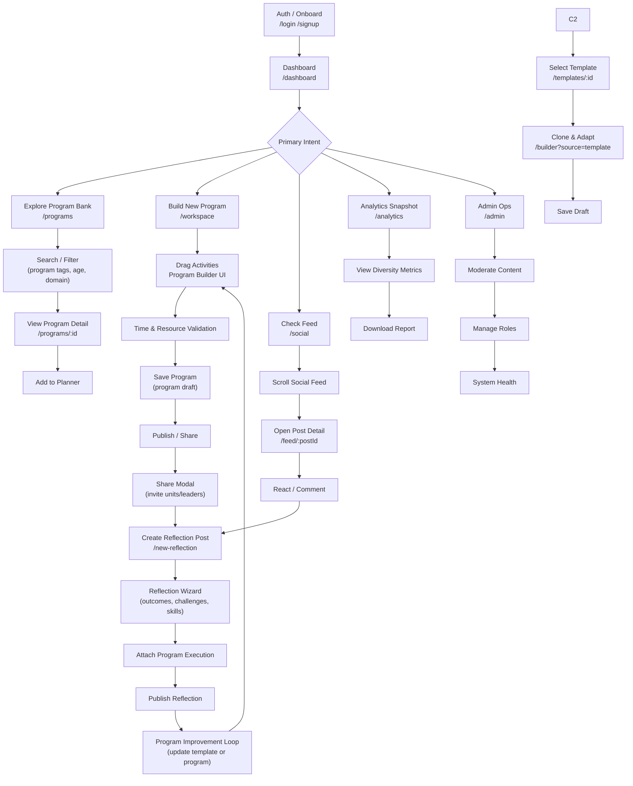
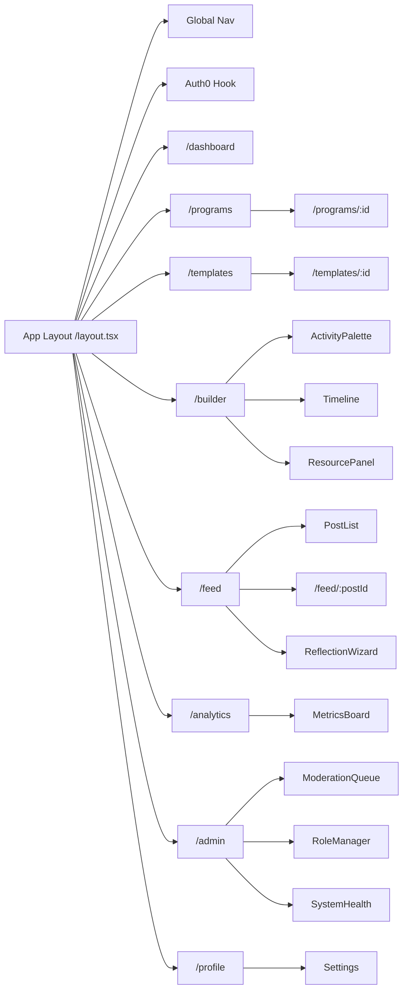

# Slóði Front-End User Interaction Flow

> Detailed flow and component architecture for leader and admin journeys.

## 1. High-Level Usage Flow

## 2. Route & Component Map

## 3. State & Data Boundaries

- Auth State: roles, permissions (Auth0 + cache).
- Program Draft: confined to Builder; autosave + versioning.
- Search Filters: URL query driven; sharable.
- Feed Interaction: optimistic updates (SWR / React Query).
- Analytics Cache: aggregated metrics; manual refresh.
- Moderation Queue: bulk action buffer.

## 4. Key UX Micro-Flows

1. Program Creation & Publish (+ optional feed announcement).
2. Template Adaptation diff tracking.
3. Reflection post with structured metadata.
4. One-click reuse (Adapt) from Program Bank.
5. Diversity check inline before final save.

## 5. Component Responsibilities

| Component | Responsibility |
|-----------|---------------|
| ActivityPalette | Fetch + filter + drag source for activities |
| Timeline | Time slot layout; conflict detection |
| ResourcePanel | Aggregate equipment/leaders; warnings |
| PostList | Infinite scroll feed + subscription |
| ReflectionWizard | Guided multi-step reflection form |
| MetricsBoard | Domain balance visualizations |
| ModerationQueue | Bulk moderation actions |

## 6. Navigation Principles

- Primary nav: Dashboard, Programs, Builder, Feed, Analytics, Admin (role gated), Profile.
- Contextual shortcuts: Adapt from Program detail; Open Program from Feed.
- URL-driven state for searches and filtered feeds.

## 7. Future Enhancements

- Offline-first caching for field use.
- Real-time collaboration cursors in Builder.
- Adaptive feed ranking emphasizing underused domains.

*Extracted user interaction flow (2025-11-20).*
